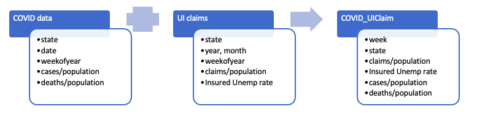
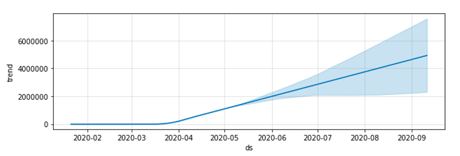
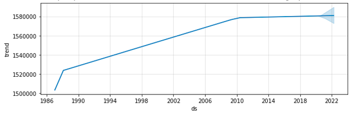
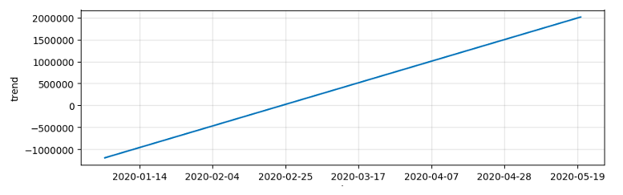

# Unemployment claims in US due to COVID-19 - Pedictive Analysis

## Objectives

- 1. To analyze, predict and visualize the distribution and number of cases of COVID19 across U.S states using __Spark__.
- 2. To predict the trend in unemployment claims based on the COVID19 cases being reported. This is achieved using the timeseries analysis of U.S Unemployment insurance claims since 1987 till April 18th, 2020 and correlating the trend with COVID19 cases in U.S.

## Datasets
1. [COVID19 dataset](https://github.com/owid/covid-19-data/tree/master/public/data) published by _Our World_ in Data for daily cases and deaths in U.S states (Jan 01, 2020 to May 6, 2020, updated daily).
2. [Weekly unemployment insurance claims](https://oui.doleta.gov/unemploy/claims.asp) from Jan 1 1987 to Apr 18 2020, across all states in U.S, published by the U.S Department of Labor. This data is not seasonally adjusted and hence would be ideal to explore the data patterns.
3. [Population data](https://www.bls.gov/sae/additional-resources/list-of-published-state-and-metropolitan-area-series/home.htm) of all states in U.S (non-institutional civilian population) since 1967, as published by the U.S Bureau of Labor Statistics. This data is used to calculate COVD19 cases and UI claims as percentage of a state’s population and do a comparative analysis on the severity of situation across the states. The data set also contains information on employment, however only population data is used. 

## Data Preprocessing
- 1. The population data is only available till March 2020, values for the months of April and May are imputed by assuming there is no change in population since March 2020. 
- 2. The three datasets used in the analysis are of different periodicity (COVID19 – daily, UI Claims – weekly, Population – monthly). To join the datasets, I computed week, month and year columns as required and aggregated the values within the considered period before executing the join operation.
- 3. Column names had spaces in the input data. This is not supported in DELTA tables. Created my own schema while loading datasets and renamed the columns.
- 4. Raw data of UI claims has commas in unemployment numbers when read from CSV file. I used a user defined function to clean the data and type casted to long datatype. 

## Data Models
Both COVID and UI claims are initially joined with population data to obtain attributes as percentage of population. This enables a fair comparison of the cases and UI claims across states. The join and the final output fields that are considered for the analysis are displayed in the chart below.

The analysis consists of three predictive models:
- 1. A time series model to predict COVID cases across all states, based on the affected population since Jan 2020. It is built using the open source library – prophet, by facebook.
- 2. A time series model to predict weekly unemployment insurance claims independent of the pandemic, based on historical data, since 1987. 
- 3. A time series model to predict weekly unemployment insurance claims by considering the COVID cases as an additional regressor in the model built in #2.

## Results and Inference

### COVID19 cases - future predictions
Below trend is obtained as a result of the time series prediction of COVID cases in 2020. The dark line denotes the historical data (till May 6, 2020) and predictions afterwards. Shaded area in the plot corresponds to error in the forecasted observations. Given the data available is small, error is high in the predictions. The prediction indicates an exponential growth in the future cases. However, the shaded region indicates a possibility of stabilization which can be attribute to the recent observations. It is not depicted in the actual trend due to the insignificant number of observations. Hence, the model needs to be continuously updated with real time data for change in trends and accurate predictions. As per the trend the number of cases will be over 1.5 million at the end of May 2020. 

### Time series Predictions - UI claims
Below is the time series prediction of UI claims till 2022. There are two points of inflection in the trend - 1987 and 2009 both corresponding to the two major economic crises in the past. The trendline for 2020 shows a slight increase in the number of UI claims which has remained constant since 2010 at 1.58 million. However, the error means that there can be an increase or decrease based on the future observations, potentially resulting in another inflection point in the UI claims trend indicating a major change. This depends on how long the pandemic lasts. Hence to get a better understanding, the model is trained using COVID cases as an input parameter and the results are described in the next graph. 
 

### Multivariate Time series Model for UI claims	
By adding COVID data as an additional regressor, the resultant UI claims data is now restricted only to the data from 2020. The number of observations (made weekly) is only 16 (by default, Prophet specifies 25 potential changepoints which are uniformly placed in the first 80% of the time series). This has resulted in an overfitted model and does not give reliable predictions. As the trend shown above, the number of claims continuously increase based on the COVID19 cases considered so far. The model without incorporating COVID cases estimated UI claims to be 15.8M during 2020, while the multivariate time series model estimates it to be 20M in June 2020. The actual UI claims till April 18, 2020, are 15M. If the COVID situation persists during coming months, the multivariate model tends to give more accurate results because it captures the impact due to the pandemic whereas it is not captured in the independent UI claims model.

## Conclusion
- Time series model for the COVID cases forecasted over 1.5 million cases at the end of May 2020 based on current trend. 
- A multivariate timeseries model has been developed to predict unemployment insurance claims in U.S based on the historical data of UI claims and COVID impact. However, the model is overfitted due to a smaller number of observations. It gives an idea of what will be the situation, if the COVID cases continuously increase. - The model needs to be further trained based on the data from recent reports which indicates that the cases have started to stabilize. Then the multivariate model can potentially be a better performer than the independent model. 
- A comparative study on states has been made to understand the affected population due to COVID. It has been observed that not all states experience pandemic with peak severity at the same time.
- When we compare the current unemployment situation with that of the 2008 recession, it is much worse given the UI claims are three times as seen in 2008. This calls for potentially much worse decline in GDP than what was seen in 2008. However, this needs to be backed up by the analysis of other economic indicators like trade, transportation, consumer prices, fuel prices etc.

## Learnings
- Data cleaning, validation and modelling in Spark using Python
- Time series Analysis using prophet library and multi variate analysis. Prophet is based on an additive model considering non-periodic changes and periodic components in a Bayesian framework with easily interpretable parameters. 	
- Query optimization using partitioned DELTA tables
- User defined functions to perform data preprocessing operations
- Databricks as an interactive interface for quick plotting and import of other libraries. 

## Challenges

- Multi variate regression is not supported directly in Prophet library. To overcome this, I initially built an independent COVID time series model and then considered its outcome as an input to the time series model of unemployment claims establishing causal dependency between the prediction outcomes of the COVID model and time series observations of UI claims.  
- Time series models are ideal in a scenario to capture seasonality of data and forecast future observations. However, the COVID data available is too less to make accurate predictions, hence the large error window in results. Small dataset is also an inhibition to build a linear regression model of COVID cases and UI claims which could have enabled a better idea of trends between two variables. 

 <!--- 
## Description of Datasets
### COVID cases:
- Duration of the data: January 2020 to May 2020
- Source: Public COVID19 dataset published by Our World in Data
- Fields:
	- Date: Date corresponding to the entry
	- State: State/province of the US 
	- Cases: Number of Corona virus cases recorded on the given day and given state
	- Deaths: Number of deaths occurred due to Corona virus cases on the given day and state
### Unemployment Insurance Claims data:
- Duration of the data: January 1976 to March 2020
- Source: US department of Labor
- Fields:
	- State: State corresponding to the entry
	- Filed Week ended: Week when the claim is filed
	- Initial Claims: The number of new claims in the current week
	- Continued Claims: Number of claims that are being carried forward from previous week
	- Reflected Week Ended: The week from which the continued claims are carried forward (i.e. the previous week)
	- Covered Employment: Number of employers that are insured
	- Insured Unemployment rate: Rate of insured unemployed population
### Population Data:
- Duration of the data: January 1976 to March 2020
- Source: US Bureau of Labor Statistics
- Fields:
	- Year, Month: Year and month corresponding to the entry
	- State: State corresponding to the entry
	- Population: Population in the given state in the given month, year
 ---!>
